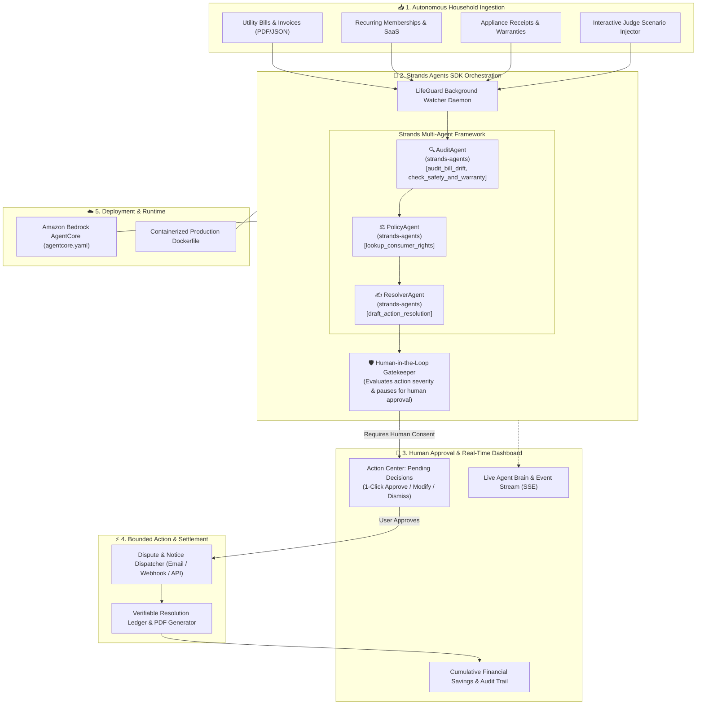

# 🛡️ LifeGuard Agent — Autonomous LifeOps & Financial Safeguard Agent

[](https://agentsforhumans.devpost.com/)
[](https://agentsforhumans.devpost.com/)
[](https://strandsagents.com)
[](https://docs.aws.amazon.com/bedrock-agentcore/)
[](LICENSE)

> **"Build an AI agent that handles routine and repetitive tasks in the background. Instead of another app people open and manage, the agent runs autonomously and only surfaces when there's a real decision to make."**  
> — *Official Challenge Brief, Agents for Humans Hackathon by AWS*

---

## 💡 Executive Summary

Every day, households lose **$600 to $1,400+ per year** to "vampire" charges:
1. **Stealth Telecom & Utility Hikes**: Promotional internet rates that expire unannounced with newly invented administrative surcharges (+36% bill creep).
2. **Zombie Subscription Traps**: Gym memberships and software auto-renewing after contract expiry, protected by archaic cancellation barriers that defy FTC rules.
3. **Expiring Warranty Windows with Active Recalls**: High-ticket home appliances and electronics nearing their 24-month warranty expiration while carrying active Consumer Product Safety Commission (CPSC) recall notices.
4. **Out-of-Network Medical Billing Errors**: Laboratory diagnostic panels billed with unbundled out-of-network CPT codes in violation of the Federal No Surprises Act.

**LifeGuard Agent** eliminates this burden. Operating as an autonomous background daemon, LifeGuard continuously audits statements, cross-references federal consumer protections (FTC, FCC, CMS, Magnuson-Moss), compiles formal legal dispute dossiers, and **only surfaces to the human principal when authorization is required to dispatch an action**.

---

## 🏛️ System Architecture



---

## ⚙️ Core Technical Highlights

### 1. Multi-Agent Orchestration with `strands-agents`
LifeGuard Agent builds upon AWS's open-source **Strands Agents SDK**, organizing specialized agents with dedicated `@tool` capabilities:
* **`audit_bill_drift`**: Detects line-item baseline drift, phantom administrative fees, and calculates projected annual leakage.
* **`lookup_consumer_rights`**: Retrieves federal/state statutory citations including **FTC Negative Option Rule (16 C.F.R. Part 425)**, **FCC Broadband Transparency (47 C.F.R. § 8.1)**, **Federal No Surprises Act (45 C.F.R. § 149.410)**, and the **Magnuson-Moss Warranty Act (15 U.S.C. § 2301)**.
* **`check_safety_and_warranty`**: Queries active Consumer Product Safety Commission (CPSC) recall campaigns matching device serial numbers and models within expiring warranty windows.
* **`draft_action_resolution`**: Synthesizes formal, legally binding dispute memos, cancellation demands, and replacement claims citing governing legal leverage.

### 2. True Human-in-the-Loop (HITL) Gating
Unlike unconstrained chatbots that hallucinate or act unpredictably, LifeGuard enforces strict **Separation of Concerns**:
* **Autonomous Ingestion & Analysis**: Operates 24/7 in the background without nagging the user.
* **Fiduciary Decision Gate**: If an action involves cancelling a contract, demanding a refund, or dispatching a legal notice, execution **pauses** and generates a structured **Decision Card**.
* **1-Click Human Execution**: The user reviews the exact annual financial value, reads the prepared dossier, and clicks `Approve & Dispatch`.

### 3. Amazon Bedrock AgentCore Compatibility
The project includes a production-ready **`agentcore.yaml`** manifest and multi-stage `Dockerfile`, configured for serverless agent deployment on Amazon Bedrock AgentCore Runtime with OpenTelemetry tracing and CloudWatch audit metrics.

---

## 🧪 Pre-Loaded Scenarios (Interactive Test Suite)

Judges can test realistic household scenarios directly from the dashboard:

| Scenario | Problem Detected | Regulatory Grounding | Prepared Resolution | Financial Impact |
| :--- | :--- | :--- | :--- | :--- |
| **Comcast Xfinity** | $22.50/mo stealth hike + new $7.50 "Regional Infrastructure Fee" | FCC Broadband Transparency (47 C.F.R. § 8.1) | Price-match demand to $55 retention promo tariff | **$270.00 / year** |
| **Apex Fitness** | $49.99/mo zombie subscription; in-person cancellation barrier | FTC Negative Option Rule (16 C.F.R. § 425) | Immediate electronic cancellation & debit revocation | **$599.88 / year** |
| **Breville Espresso** | Warranty expires in 5 days; active CPSC boiler pressure recall | Magnuson-Moss Warranty Act (15 U.S.C. § 2301) | Manufacturer recall claim for free replacement unit | **$899.95 (MSRP)** |
| **Quest Diagnostics** | $420.00 out-of-network balance bill for in-network clinic visit | Federal No Surprises Act (45 C.F.R. § 149.410) | Balance bill dispute capping patient cost at $85 | **$335.00 (Savings)** |

---

## 🚀 Quickstart Guide

### Prerequisites
* Python 3.10+ (Tested on Python 3.13)
* Node.js v18+ & npm

### 1. Clone & Setup Backend
```bash
# Clone the repository
git clone https://github.com/Arnab758/AgentsforHumans.git
cd AgentsforHumans

# Install Python dependencies
pip install -r requirements.txt

# Run automated tests
pytest tests/ -v

# Start the LifeGuard Agent Backend Server
python -m uvicorn backend.app.main:app --host 0.0.0.0 --port 8000 --reload
```

### 2. Setup & Start Frontend Dashboard
```bash
# In a new terminal window:
cd frontend
npm install
npm run dev
```

Open `http://localhost:5173` in your browser.

---

## 📁 Repository Structure

```
AgentsforHumans/
├── README.md                      # Architecture, pitch, and quickstart
├── LICENSE                        # MIT Open Source License
├── agentcore.yaml                 # Amazon Bedrock AgentCore Specification
├── Dockerfile                     # Containerized production runtime
├── requirements.txt               # strands-agents, fastapi, uvicorn, sse-starlette
│
├── backend/                       # Python Backend with Strands Agents Core
│   └── app/
│       ├── main.py                # FastAPI endpoints & SSE streaming telemetry
│       ├── config.py              # AWS Bedrock & model fallback settings
│       ├── agent/
│       │   ├── orchestrator.py    # Multi-agent autonomous loop
│       │   └── tools/             # Strands @tool definitions
│       │       ├── bill_parser.py
│       │       ├── policy_checker.py
│       │       ├── recall_database.py
│       │       └── dispute_drafter.py
│       ├── hitl/
│       │   └── decision_manager.py # Human-in-the-Loop approval state machine
│       ├── data/                  # Pre-loaded test scenarios (JSON)
│       └── models/
│           └── schemas.py         # Pydantic models
│
├── frontend/                      # React 18 + Vite Web Dashboard
│   ├── src/
│   │   ├── App.jsx                # Interactive application layout
│   │   ├── index.css              # Dark-mode glassmorphic styling
│   │   └── components/            # ActionCenter, AgentTrace, ScenarioInjector
│   └── package.json
│
├── docs/                          # Submission Deliverables
│   ├── BUILDER_AWS_BLOG.md        # Ready-to-publish builder.aws.com post (+0.6 bonus)
│   └── PITCH_VIDEO_STORYBOARD.md  # 4-minute pitch video script
│
└── tests/
    └── test_audit_engine.py       # Automated unit test suite
```

---

## ⚖️ License

Distributed under the **MIT License**. See [`LICENSE`](LICENSE) for more information.
