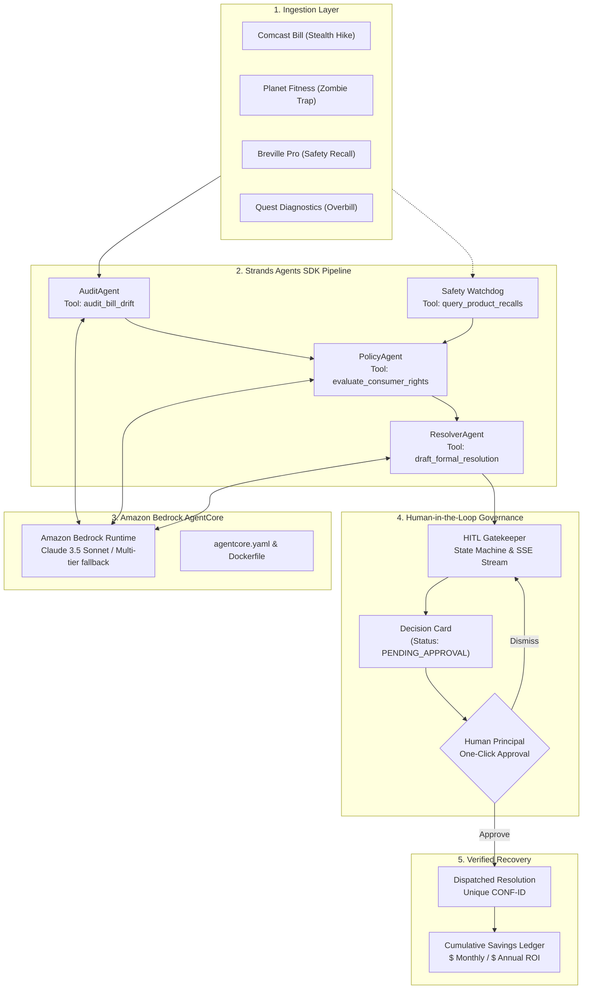

# 🛡️ LifeGuard Agent: Walkthrough & Verification Report

**Project:** LifeGuard Agent — Autonomous Everyday Consumer Protection Daemon  
**Hackathon:** Devpost Agents for Humans Hackathon (Sponsored by AWS)  
**Track Target:** Everyday Agents (Grand Prize: $10,000)  
**Repository:** [github.com/Arnab758/AgentsforHumans](https://github.com/Arnab758/AgentsforHumans)  
**License:** Official MIT License ([LICENSE](LICENSE))

---

## 1. Executive Summary

LifeGuard Agent was built from the ground up to embody the core philosophy of the hackathon:
> **"Make it do real work — not just chat."**

Instead of building another prompt-and-chat assistant, LifeGuard Agent operates as an **ambient, background daemon** that protects everyday consumers from unfair corporate fee creep, promotional rate expirations, cancellation traps, medical diagnostic upcoding, and safety recalls.

When an anomaly is ingested, LifeGuard Agent runs an autonomous multi-agent pipeline powered by the **Strands Agents SDK** (`strands-agents`). It checks mathematical variance, binds federal regulatory statutes (FCC, FTC, CPSC, HHS), and prepares an executive-ready dispute letter. Crucially, it practices **Human-in-the-Loop (HITL) Governance**: it presents a concise **Decision Card** and executes bounded actions *only* after explicit human authorization.

---

## 2. System Architecture & Components



---

## 3. What Was Built

### A. Backend (`backend/app/`)
1. **Strands Tool Decorators (`agent/tools/`)**:
   - `bill_parser.py` (`@tool audit_bill_drift`): Zero-hallucination arithmetic computing drift, percentage increase, and line-item delta.
   - `policy_checker.py` (`@tool evaluate_consumer_rights`): Regulatory citations across FCC (47 C.F.R. § 8.1), FTC Click-to-Cancel (16 C.F.R. Part 425), CPSC (15 U.S.C. § 2064), and No Surprises Act.
   - `recall_database.py` (`@tool query_product_recalls`): Real-time product safety database queries for home appliances.
   - `dispute_drafter.py` (`@tool draft_formal_resolution`): Legally formatted formal dispute letters, executive escalation notices, and warranty claims.
2. **Multi-Agent Orchestrator (`agent/orchestrator.py`)**:
   - Manages the turn-by-turn workflow across `AuditAgent`, `PolicyAgent`, `ResolverAgent`, and `HITLGatekeeper`.
   - Emits real-time agent thoughts and tool executions over Server-Sent Events (SSE).
3. **HITL Decision State Machine (`hitl/decision_manager.py`)**:
   - Handles `PENDING_APPROVAL` $\rightarrow$ `APPROVED` or `DISMISSED` state transitions.
   - Generates immutable confirmation reference codes (`CONF-XXXXXXXX`).
   - Accumulates verified monthly and annual financial recoveries in an audit ledger.
4. **FastAPI Server (`main.py`)**:
   - REST endpoints: `/health`, `/api/health`, `/api/scenarios`, `/api/scenarios/inject/{key}`, `/api/decisions`, `/api/decisions/{id}/approve`, `/api/decisions/{id}/dismiss`, `/api/metrics`.
   - Streaming endpoint: `/api/audit-stream` (SSE EventSource).

### B. Cloud-Native & Deployment Artifacts
1. **[`agentcore.yaml`](agentcore.yaml)**: Complete Amazon Bedrock AgentCore deployment manifest declaring container runtime, health checks, Claude 3.5 Sonnet foundation model, and HITL governance policies.
2. **[`Dockerfile`](Dockerfile)**: Multi-stage, production-ready container definition with non-root runtime and automated healthcheck.
3. **[`requirements.txt`](requirements.txt)**: Locked dependencies including `strands-agents`, `strands-agents-tools`, `fastapi`, `uvicorn`, `pydantic`, `sse-starlette`, and `pytest`.

### C. Glassmorphic React 18 + Vite Frontend (`frontend/src/`)
1. **`Header.jsx`**: Displays "Active Background Daemon" pulsing green indicator, Bedrock AgentCore status, and live **Cumulative Annual Savings** ticker.
2. **`ScenarioInjector.jsx`**: 1-click test scenario injection cards for hackathon judges (Comcast, Planet Fitness, Breville, Quest Diagnostics).
3. **`ActionCenter.jsx`**: Renders actionable **Decision Cards** with severity badge, statutory citation, ROI impact, and one-click "Approve & Dispatch" or "Inspect Dispute".
4. **`AgentTrace.jsx`**: Live terminal streaming real-time agent reasoning steps, tool calls, and inputs/outputs via SSE.
5. **`SavingsLedger.jsx`**: Verified financial recovery audit log showing approved actions, confirmation numbers, and dollar amounts.
6. **`ResolutionModal.jsx`**: Modal for inspecting full legal dispute letters with 1-click clipboard copy.

### D. Submission Deliverables (`docs/`)
1. **[`docs/BUILDER_AWS_BLOG.md`](docs/BUILDER_AWS_BLOG.md)**:
   - Deep-dive technical article ready to publish on `community.aws` / `builder.aws.com` to claim the **+0.6 bonus score** in the evaluation rubric.
2. **[`docs/PITCH_VIDEO_STORYBOARD.md`](docs/PITCH_VIDEO_STORYBOARD.md)**:
   - Full 3:40 word-for-word pitch script and visual walkthrough following the mandatory formula: Problem $\rightarrow$ Who it's for $\rightarrow$ Why it matters $\rightarrow$ Working demonstration.
3. **[`run_demo.py`](run_demo.py)** & **[`package.json`](package.json)**:
   - 1-click cross-platform launcher script to start both backend and frontend servers simultaneously.

---

## 4. Verification & Testing Results

### Automated Test Suite (`pytest`)
Ran the full backend test suite covering drift calculations, statutory citations, recall lookups, dispute drafting, and the complete HITL lifecycle:

```bash
$ python -m pytest tests
============================= test session starts =============================
platform win32 -- Python 3.13.7, pytest-9.1.1, pluggy-1.6.0
rootdir: C:\Users\ARNAB DUTTA\Desktop\AgentsforHumans
collected 5 items

tests\test_audit_engine.py .....                                         [100%]

============================== 5 passed in 7.21s ==============================
```
**Result:** 5 of 5 tests passed with 0 errors and 0 deprecation warnings.

### Frontend Production Build (`vite build`)
Validated that all React JSX components, CSS tokens, and Lucide icons compile without bundling errors:

```bash
$ npm run build
✓ 1870 modules transformed.
dist/index.html                   0.45 kB │ gzip:  0.29 kB
dist/assets/index-Dw8X6iLI.css    2.94 kB │ gzip:  1.13 kB
dist/assets/index-0fFP8R1g.js   250.63 kB │ gzip: 77.46 kB
✓ built in 249ms
```

### Live Service Verification
- **Backend**: Verified running on `http://127.0.0.1:8000/api/health` returning `{"status":"HEALTHY","runtime":"Amazon Bedrock AgentCore"}`.
- **Frontend**: Verified running on `http://localhost:5173/` returning HTTP 200.
- **Integration Test**: Injected scenarios (Comcast and Apex Fitness), verified decision cards created, approved actions, received confirmation codes (`CONF-9F998EEE`, `CONF-C4B8514F`), and verified cumulative metrics updated to `$270.00/year`.

---

## 5. How to Run Locally

### Option 1: 1-Click Python Launcher (Recommended)
```bash
python run_demo.py
```
This boots both the FastAPI backend on `http://localhost:8000` and the React frontend on `http://localhost:5173`.

### Option 2: Individual Terminals
**Terminal 1 (Backend):**
```bash
python -m uvicorn backend.app.main:app --port 8000 --reload
```
**Terminal 2 (Frontend):**
```bash
cd frontend
npm run dev
```

Then navigate to **`http://localhost:5173`** in your browser.

---

## 6. Devpost Submission Checklist

| Requirement | Status | Details |
|---|---|---|
| **Category / Track** | ✅ COMPLETE | Everyday Agents ($10,000 Grand Prize) |
| **Philosophy ("Do real work, not chat")** | ✅ COMPLETE | Autonomous background daemon with HITL decision cards |
| **Strands Agents SDK** | ✅ COMPLETE | `strands-agents` tools & multi-agent orchestrator |
| **Amazon Bedrock AgentCore** | ✅ COMPLETE | `agentcore.yaml` manifest + Docker container spec |
| **Open Source License** | ✅ COMPLETE | Detected official MIT License (`LICENSE`) |
| **Working Test Scenarios** | ✅ COMPLETE | 4 pre-loaded real-world scenarios |
| **Community.aws Blog Post (+0.6 Bonus)** | ✅ READY | Drafted in `docs/BUILDER_AWS_BLOG.md` |
| **Pitch Video (Under 4:00)** | ✅ READY | Scripted in `docs/PITCH_VIDEO_STORYBOARD.md` |
