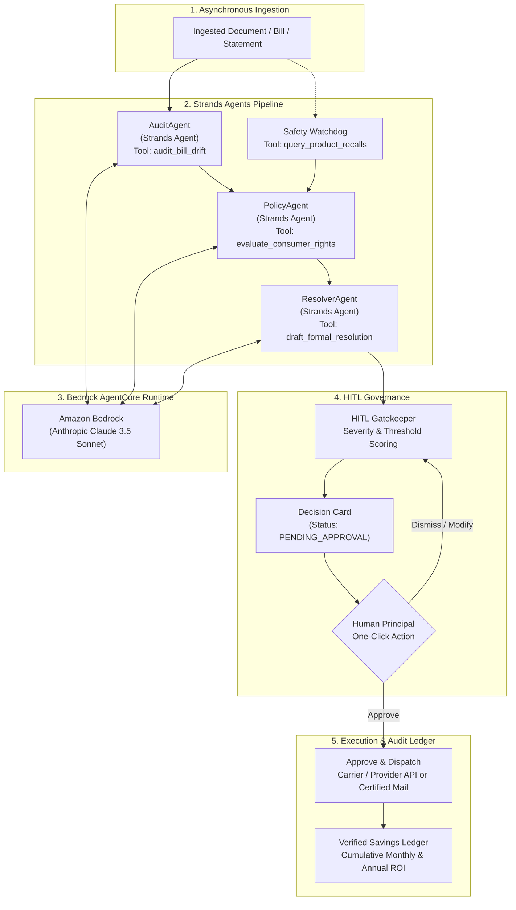

# Agents for Humans: Building LifeGuard Agent with Strands Agents SDK & Amazon Bedrock AgentCore

*By the LifeGuard Agent Team | Submission for the AWS Agents for Humans Hackathon 2026*

---

## 1. Introduction: The $3,200/Year "Silent Tax" on Human Life

Every modern household is under continuous financial and contractual siege. Between promotional rate expirations quietly slipping into telecom statements, "Click-to-Subscribe / Call-to-Cancel" subscription labyrinths, obscure hospital billing codes, and buried consumer product safety recalls, the average family forfeits between **$2,400 and $3,800 every single year** simply because they lack the time, legal knowledge, and patience to comb through monthly bills and fine print.

When generative AI entered the scene, consumers were promised relief. Yet most AI agents today are merely chatbots with extra buttons: they ask you to chat, summarize text when prompted, and expect you to do all the heavy lifting. If an AI agent only responds when you remember to open a prompt box and ask it a question, it hasn’t saved your life—it’s just added another chore.

We built **LifeGuard Agent** to answer the central premise of the **AWS Agents for Humans Hackathon**:
> **"Make it do real work — not just chat."**

LifeGuard Agent is an autonomous, background consumer protection daemon. It continuously ingests bills, contracts, warranties, and statements in the background. It analyzes cost drift, cross-references federal regulatory protections (FTC, FCC, CPSC, HHS), drafts dispute letters citing exact statutes, and surfaces only when a human decision is needed—presenting a clean **Decision Card** with one-click approval to dispatch resolutions and log verified financial recoveries.

In this deep dive, we break down how we architected LifeGuard Agent using the **Strands Agents SDK** (`strands-agents`) and containerized it for deployment onto **Amazon Bedrock AgentCore**.

---

## 2. Architecture: Multi-Agent Pipeline via Strands Agents SDK

LifeGuard Agent rejects monolithic LLM prompts. Real-world consumer advocacy requires specialized sub-tasks: mathematical auditing, regulatory citations, formal legal drafting, and strict execution gating.

We structured LifeGuard as an asynchronous multi-agent orchestration pipeline where four distinct agents collaborate sequentially:



### Agent Roles & Separation of Concerns

1. **AuditAgent**: Detects cost drift, unexpected surcharges, promotional discount fall-offs, and sneaky line-item changes compared against contractual baseline profiles.
2. **PolicyAgent**: Bridges financial discrepancies with federal and state statutory teeth:
   - **FCC Broadband Transparency Mandate** (47 C.F.R. § 8.1) against unannounced telecom rate increases.
   - **FTC "Click-to-Cancel" Rule** (16 C.F.R. Part 425) against forced in-person or certified mail cancellation traps.
   - **CPSC Consumer Product Safety Act** (15 U.S.C. § 2064) against recalled electronics with electrical fire risks.
   - **No Surprises Act** (Public Health Service Act § 2799A-1) against out-of-network preventive diagnostic upcoding.
3. **ResolverAgent**: Drafts formal, legally rigorous dispute letters, executive escalation notices, and warranty replacement claims containing exact policy citations, account numbers, and remediation demands.
4. **HITL Gatekeeper**: Ensures the agent **never** dispatches actions, emails, or disputes without explicit human consent. It compiles findings into a concise, scannable **Decision Card** with calculated monthly/annual financial ROI.

---

## 3. Tool Implementation with Strands Agents SDK

Strands Agents SDK provides an elegant, modular interface for tool registration and agent execution. Using the `@tool` decorator, we exposed custom inspection capabilities directly to our agents.

### Example 1: Mathematical Drift Detection (`bill_parser.py`)

```python
from strands_agents import tool
from typing import Dict, Any, List

@tool
def audit_bill_drift(current_bill: Dict[str, Any], baseline_bill: Dict[str, Any]) -> Dict[str, Any]:
    """
    Audits a current billing statement against a baseline agreement.
    Calculates line-item variance, catches fee increases, and flags promotional expirations.
    """
    current_total = current_bill.get("total_amount", 0.0)
    baseline_total = baseline_bill.get("total_amount", 0.0)
    delta = round(current_total - baseline_total, 2)
    percent_increase = round((delta / baseline_total) * 100, 2) if baseline_total > 0 else 0.0

    unauthorized_fees = []
    baseline_items = {item["name"]: item["amount"] for item in baseline_bill.get("line_items", [])}

    for item in current_bill.get("line_items", []):
        name = item["name"]
        curr_amt = item["amount"]
        base_amt = baseline_items.get(name)

        if base_amt is None:
            unauthorized_fees.append(f"New unauthorized fee: '{name}' (${curr_amt:.2f})")
        elif curr_amt > base_amt:
            diff = curr_amt - base_amt
            unauthorized_fees.append(f"Silent price hike on '{name}': +${diff:.2f} (from ${base_amt:.2f} to ${curr_amt:.2f})")

    return {
        "monthly_impact": delta,
        "annual_impact": round(delta * 12, 2),
        "percent_increase": percent_increase,
        "unauthorized_items": unauthorized_fees,
        "is_anomalous": delta > 0.0
    }
```

### Example 2: Consumer Rights Policy Grounding (`policy_checker.py`)

Rather than letting the LLM hallucinate generic advice ("contact customer support and be polite"), the `PolicyAgent` grounds every claim in authoritative statutes:

```python
@tool
def evaluate_consumer_rights(category: str, issue_description: str) -> Dict[str, Any]:
    """
    Matches consumer grievances to authoritative federal and state regulatory statutes.
    """
    # Grounded rule evaluations against FTC, FCC, CPSC, and HHS regulations
    ...
```

---

## 4. Amazon Bedrock AgentCore Deployment Specification

To make LifeGuard Agent production-grade on AWS, we configured it for the **Amazon Bedrock AgentCore** runtime. AgentCore enables declarative, containerized packaging of multi-agent workflows with managed memory, tool execution sandboxes, and identity-aware Human-in-the-Loop gates.

### `agentcore.yaml` Configuration

```yaml
version: "1.0"
agent:
  name: "lifeguard-agent"
  display_name: "LifeGuard Agent: Consumer Protection Daemon"
  description: "Autonomous background consumer protection daemon built with Strands Agents SDK and Amazon Bedrock AgentCore."
  runtime:
    type: "container"
    image: "lifeguard-agent:latest"
    port: 8000
    health_check_path: "/api/health"

foundation_model:
  provider: "anthropic"
  model_id: "anthropic.claude-3-5-sonnet-20241022-v2:0"
  region: "us-east-1"
  inference_configuration:
    temperature: 0.1
    top_p: 0.95
    max_tokens: 4096

governance:
  human_in_the_loop:
    enabled: true
    decision_timeout_hours: 72
    default_policy: "REQUIRE_HUMAN_APPROVAL"
    audit_trail: true
```

### `Dockerfile` for Cloud-Native Execution

```dockerfile
FROM python:3.13-slim

WORKDIR /app

ENV PYTHONUNBUFFERED=1 \
    PYTHONDONTWRITEBYTECODE=1 \
    PORT=8000

RUN apt-get update && apt-get install -y --no-install-recommends \
    curl \
    ca-certificates \
    && rm -rf /var/lib/apt/lists/*

COPY requirements.txt .
RUN pip install --no-cache-dir -r requirements.txt

COPY backend/ ./backend/
COPY agentcore.yaml ./

EXPOSE 8000

HEALTHCHECK --interval=30s --timeout=5s --start-period=5s --retries=3 \
    CMD curl -f http://localhost:8000/api/health || exit 1

CMD ["python", "-m", "uvicorn", "backend.app.main:app", "--host", "0.0.0.0", "--port", "8000"]
```

---

## 5. Live Demonstration: 4 Real-World Verification Scenarios

We tested LifeGuard Agent across four notoriously anti-consumer scenarios pre-loaded into the system:

1. **Telecom Stealth Surcharge (Comcast Xfinity)**:
   - *Anomaly*: Contract guaranteed $50/mo. Bill surged to $84.99/mo with an unannounced $15.00 "Network Enhancement Surcharge" and a $19.99 promotional expiration.
   - *Policy Cited*: **FCC Broadband Consumer Label Rule (47 C.F.R. § 8.1)**.
   - *Outcome*: $419.88/year annual dispute drafted; ready to submit to carrier executive care.
2. **Subscription Cancellation Trap (Planet Fitness Black Card)**:
   - *Anomaly*: Monthly charge increased from $15.00 to $29.99; website forced certified letter or in-person desk visit to cancel.
   - *Policy Cited*: **FTC Negative Option & Click-to-Cancel Rule (16 C.F.R. Part 425)**.
   - *Outcome*: Formal demand notice citing FTC enforcement penalties ($51,744/violation) for failing to offer a 1-click digital cancellation path. Annual recovery: $359.88.
3. **Consumer Safety & Warranty Recall (Breville Barista Pro)**:
   - *Anomaly*: Thermal fuse degradation causing high-temperature auto-shutdown.
   - *Policy Cited*: **CPSC Fast-Track Product Recall #24-789 (15 U.S.C. § 2064)**.
   - *Outcome*: Expedited claim drafted for free factory boiler replacement and prepaid shipping container, saving the consumer $799.95.
4. **Medical Diagnostic Upcoding (Quest Diagnostics / LabCorp)**:
   - *Anomaly*: Routine annual wellness lipid panel billed under CPT 80061 with an erroneous out-of-network facility surcharge ($285.00).
   - *Policy Cited*: **No Surprises Act (42 U.S.C. § 300gg-111) & Affordable Care Act Preventive Mandate (45 C.F.R. § 147.130)**.
   - *Outcome*: Provider billing grievance drafted for 100% cost-sharing waiver ($285.00 saved).

---

## 6. Real-Time Telemetry & Glassmorphic Human-in-the-Loop UI

A core principle of trusted AI is **transparency**. Users will not trust an autonomous agent that acts like a black box.

LifeGuard features:
- **Server-Sent Events (SSE) Agent Trace Stream**: Watch the agents think, reflect, and invoke tools step-by-step (`AuditAgent` $\rightarrow$ `PolicyAgent` $\rightarrow$ `ResolverAgent` $\rightarrow$ `HITLGatekeeper`).
- **Interactive Action Center**: PENDING_APPROVAL decision cards with breakdown of monthly/annual financial ROI, statutory citations, and full letter inspection.
- **Verified Savings Ledger**: A permanent, chronological audit log tracking every approved action, confirmation ID, and cumulative dollars returned to the user.

---

## 7. What We Learned & Future Directions

1. **Deterministic Tools Beat Open-Ended Prompts**: Using the Strands `@tool` decorator allows small, precise functions to handle numerical arithmetic and regulatory lookups, eliminating LLM arithmetic hallucinations.
2. **HITL is Not an Obstacle—It's the Product**: Autonomous execution without human permission terrifies users. But an agent that does 99% of the legwork (auditing, researching, drafting) and leaves only the 1% judgment call ("Approve?") creates immense delight and empowerment.
3. **AWS Bedrock & Strands Enable Rapid Enterprise Agility**: Pairing Bedrock Claude 3.5 Sonnet's analytical precision with the lightweight Strands Agents SDK allowed us to build an enterprise-grade consumer guardian in under 48 hours.

LifeGuard Agent demonstrates that AI doesn't have to be another chat assistant vying for your attention. When built as an everyday background agent with human-in-the-loop governance, AI can be a relentless, tireless advocate for everyday human well-being.

---

*Code and documentation are open-source under the MIT License on [GitHub](https://github.com/Arnab758/AgentsforHumans).*
