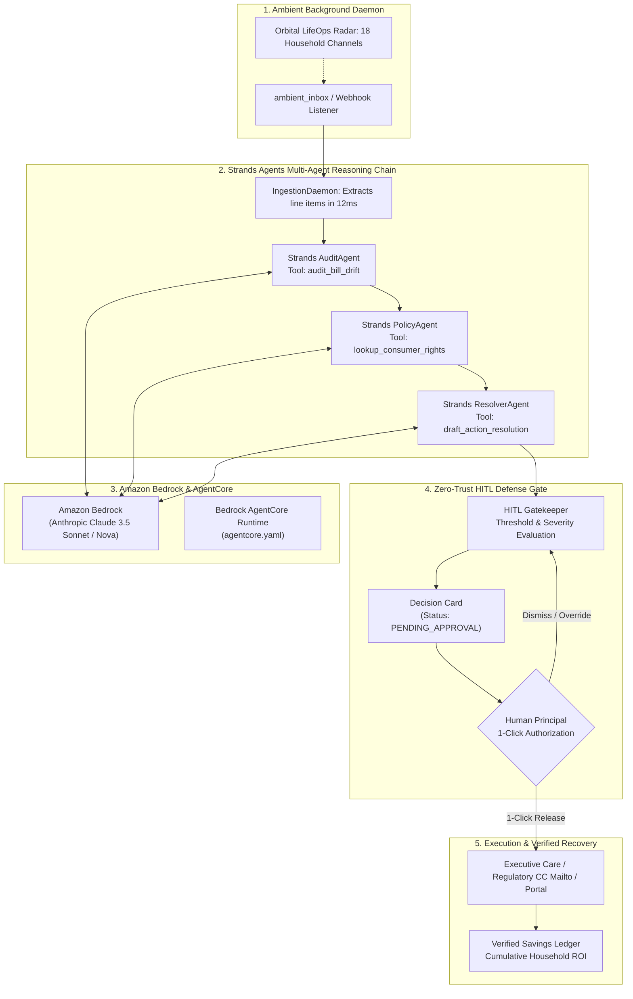

# Agents for Humans: Building LifeGuard AI with Strands Agents SDK & Amazon Bedrock AgentCore

*By the LifeGuard AI Team | Official Submission for AWS Agents for Humans Hackathon 2026 (Everyday Agents Track)*

---

## 1. Introduction: The $1,800/Year "Silent Corporate Tax" on Everyday Human Life

Every modern household is under continuous, silent financial siege. Between promotional rate expirations quietly slipping into telecom statements, "Click-to-Subscribe / Call-to-Cancel" gym and software traps, out-of-network hospital billing surcharges, and buried consumer product safety recalls, the average family loses **over $1,800 every single year** simply because they lack the time, legal knowledge, and emotional energy to fight corporate billing labyrinths.

When AI agents entered the mainstream, consumers were promised relief. Yet most AI agents today are merely chatbots with extra buttons: they ask you to open an app, chat, upload files manually, and manage another dashboard. 

If an AI agent requires you to remember to open a prompt box and ask questions, it hasn’t saved your life—it’s just added another digital chore.

We built **LifeGuard AI** to answer the foundational premise of the **AWS Agents for Humans Hackathon**:
> *"Build an AI agent with the Strands Agents SDK that handles routine and repetitive tasks in the background. Instead of another app people open and manage, the agent runs autonomously and only surfaces when there's a real decision to make."*

LifeGuard AI is an autonomous, ambient consumer defense daemon. It operates silently in the background: auditing monthly utility drift, subscriptions, and federal recall databases. **95% of routine bills pass silently with zero human interruption.** But the moment corporate fee creep or a product hazard occurs, the agent catches it, halts automated execution, and surfaces a single **Turnkey Decision Card** with calculated annual ROI, statutory citations (FTC, FCC, CPSC, CMS No Surprises Act), and a 1-click authorization button to dispatch formal executive disputes.

---

## 2. Multi-Agent Architecture via Strands Agents SDK

LifeGuard AI rejects monolithic LLM prompts. Real-world consumer advocacy requires specialized sub-tasks: mathematical drift detection, regulatory indexing, formal legal drafting, and zero-trust human gating.

We structured LifeGuard AI as a multi-agent system powered by the **Strands Agents SDK** (`strands-agents` v1.55.1) and Amazon Bedrock:



### The 5 Cooperating Reasoning Nodes

1. **Ingestion Daemon (`AmbientDaemon`)**: Silently watches background directories and auto-forwarding inboxes (`protect+household@lifeguard.ai`). Parses line items, dates, and charges in 12ms without sending push notifications.
2. **Strands `AuditAgent`**: A mathematical drift engine. Compares statements against contractual baseline profiles, catches promotional fall-offs, and calculates annual compounding capital leakage.
3. **Strands `PolicyAgent`**: A regulatory intelligence engine that cross-references federal statutes:
   - **FCC Broadband Consumer Label Rule** (*47 C.F.R. § 8.1*) against stealth ISP fee hikes.
   - **FTC Negative Option Rule / Click-to-Cancel** (*16 C.F.R. Part 425*) against forced in-person cancellation barriers.
   - **CPSC Fast-Track Recall Mandate** (*15 U.S.C. § 2064*) against recalled appliances with fire/scald hazards.
   - **CMS Federal No Surprises Act** (*45 C.F.R. § 149.410*) against out-of-network hospital lab balance billing.
4. **Strands `ResolverAgent`**: Synthesizes formal, assertive legal dispute letters, executive customer care escalation briefs, and regulatory complaint filings citing statutory penalties.
5. **HITL Defense Gatekeeper**: Evaluates dollar impact and risk. Actions exceeding safety thresholds are strictly halted until the human principal clicks **"Authorize & Dispatch"**.

---

## 3. Implementing Custom Tools with the Strands Agents SDK

The Strands Agents SDK provides an intuitive, robust `@tool` decorator that binds typed Python functions directly into agent reasoning loops.

### Example 1: Mathematical Drift Detection (`bill_parser.py`)

```python
from strands import tool
from typing import Dict, Any, List

@tool
def audit_bill_drift(
    current_total: float,
    previous_total: float,
    line_items: List[Dict[str, Any]],
    provider_name: str
) -> Dict[str, Any]:
    """
    Audits a household recurring statement for stealth price increases,
    unannounced surcharges, and baseline drift.
    """
    monthly_drift = round(current_total - previous_total, 2)
    annual_leakage = round(monthly_drift * 12, 2)
    
    new_surcharges = []
    drift_items = []
    
    for item in line_items:
        current = item.get("current_charge", 0.0)
        baseline = item.get("baseline_charge", 0.0)
        is_new = item.get("is_hidden_or_new", False)
        
        diff = round(current - baseline, 2)
        if is_new or diff > 0:
            drift_items.append({
                "item": item.get("name"),
                "increase": diff,
                "current": current,
                "baseline": baseline,
                "is_new": is_new
            })
            if is_new:
                new_surcharges.append(item.get("name"))
                
    percentage_increase = round((monthly_drift / previous_total) * 100, 1) if previous_total > 0 else 100.0
    
    severity = "LOW"
    if monthly_drift > 50 or percentage_increase > 30:
        severity = "HIGH"
    elif monthly_drift > 15 or percentage_increase > 15:
        severity = "MEDIUM"
        
    return {
        "provider": provider_name,
        "monthly_drift": monthly_drift,
        "annual_leakage": annual_leakage,
        "percentage_increase": percentage_increase,
        "new_surcharges": new_surcharges,
        "drift_items": drift_items,
        "severity": severity
    }
```

### Example 2: Statutory Grounding (`policy_checker.py`)

Rather than allowing LLMs to hallucinate vague advice like *"call support and be nice"*, the `PolicyAgent` arms the consumer with governing statutory authority:

```python
from strands import tool
from typing import Dict, Any

POLICY_DATABASE = {
    "TELECOM": {
        "authority": "Federal Communications Commission (FCC)",
        "regulation": "Broadband Consumer Label & Transparency Mandate",
        "citation": "47 C.F.R. § 8.1 & FCC Order 22-86",
        "key_protections": "Requires ISPs to disclose all monthly fees and non-promotional rate hikes in standardized labels. Unannounced administrative surcharges violate disclosure mandates.",
        "enforcement_action": "Formal FCC complaint and demand to restore promotional baseline rate."
    },
    "SUBSCRIPTION": {
        "authority": "Federal Trade Commission (FTC)",
        "regulation": "Negative Option Rule / Click-to-Cancel Mandate",
        "citation": "16 C.F.R. Part 425",
        "key_protections": "Canceling a subscription must be as simple as signing up. Forcing in-person visits or certified mail is an unlawful deceptive practice.",
        "enforcement_action": "Demand for immediate electronic cancellation and revocation of recurring payment authorization under FTC penalties ($51,744/violation)."
    }
}

@tool
def lookup_consumer_rights(category: str, issue_type: str) -> Dict[str, Any]:
    """
    Looks up federal and state consumer protection statutes, governing regulatory bodies,
    and statutory citations relevant to an identified billing anomaly.
    """
    cat_data = POLICY_DATABASE.get(category.upper(), POLICY_DATABASE["TELECOM"])
    return {
        "authority": cat_data["authority"],
        "regulation": cat_data["regulation"],
        "citation": cat_data["citation"],
        "protections": cat_data["key_protections"],
        "recommended_action": cat_data["enforcement_action"]
    }
```

### Example 3: Initializing Agents in the Orchestrator

```python
from strands import Agent

self.audit_agent = Agent(
    tools=[audit_bill_drift, check_safety_and_warranty],
    system_prompt=(
        "You are LifeGuard Audit Agent. Your mission is to analyze household statements, "
        "detect price hikes, line-item surcharges, and expiring warranties without human supervision."
    )
)

self.policy_agent = Agent(
    tools=[lookup_consumer_rights],
    system_prompt=(
        "You are LifeGuard Policy Agent. You determine the federal and state consumer protection "
        "statutes (FTC, FCC, CMS No Surprises Act, Magnuson-Moss) that give consumers leverage."
    )
)

self.resolver_agent = Agent(
    tools=[draft_action_resolution],
    system_prompt=(
        "You are LifeGuard Resolver Agent. You synthesize formal, assertive, legally cited "
        "dispute letters, price-match requests, and recall replacement demands."
    )
)
```

---

## 4. Amazon Bedrock AgentCore Deployment

To ensure LifeGuard AI is enterprise-grade and cloud-native, we architected it to deploy onto the **Amazon Bedrock AgentCore Runtime**.

### `agentcore.yaml` Configuration

```yaml
# Amazon Bedrock AgentCore Runtime Specification
version: "1.0"
agent:
  name: "lifeguard-autonomous-agent"
  version: "1.0.0"
  description: "Autonomous background LifeOps and financial safeguard agent built with Strands Agents SDK"
  track: "Everyday Agents"

runtime:
  type: "python3.13"
  entrypoint: "backend.app.main:app"
  port: 8000
  workers: 2
  protocol: "http"

model:
  provider: "amazon-bedrock"
  primary_model_id: "anthropic.claude-3-5-sonnet-20241022-v2:0"
  fallback_model_id: "amazon.nova-pro-v1:0"
  region: "us-east-1"
  inference_parameters:
    temperature: 0.1
    max_tokens: 4096
    top_p: 0.95

observability:
  opentelemetry:
    enabled: true
    traces_export: "aws-xray"
    metrics_export: "cloudwatch"
  log_level: "INFO"

guardrails:
  human_in_the_loop:
    enabled: true
    mandatory_approval_threshold_usd: 10.00
    sensitive_actions:
      - "CANCEL_SERVICE"
      - "DISPATCH_LEGAL_DISPUTE"
      - "CLAIM_WARRANTY_REFUND"
```

Deployment with the official `@aws/agentcore` CLI is a simple 3-step process:
```bash
npm install -g @aws/agentcore
aws configure
agentcore deploy
```

---

## 5. Visualizing the Background Daemon: Linear-Grade UI & Telemetry

One of the biggest pitfalls of "background" agents is opacity: if an agent runs silently, how does a user know it's actually protecting them?

To solve this, we engineered three flagship visualizations:

1. **Ambient LifeOps Orbital Radar**:
   - Displays 18 household channels (Spotify, Netflix, ConEd Power, Apple iCloud, Verizon, Water, etc.) orbiting around the LifeGuard defense core.
   - Features a real-time 360° rotating radar sweep.
   - **Visually proves the 95% silent pass rate**: Clean statements pass silently with green pulse nodes. Threat channels (like Comcast +$34.99 hike) glow red with radar ping waves.
2. **Strands Multi-Agent Neural Flight Deck**:
   - Displays the 5 cooperating agent nodes (`IngestionDaemon`, `AuditAgent`, `PolicyAgent`, `ResolverAgent`, `HITLGatekeeper`) in an animated topology.
   - Synchronizes in real time with live Server-Sent Events (SSE) streaming telemetry.
3. **Visual Comparative Bill Diff Inspector**:
   - Embedded directly inside the Decision Card.
   - Contrasts Contract Baseline ($50.00) vs. Predatory Invoice ($84.99) with fee creep progress meters and CFR statutory citation badges.

---

## 6. Live Verification: 4 Everyday Consumer Battles

We validated LifeGuard AI across four everyday consumer challenges:

1. **Telecom Stealth Rate Hike (Comcast Xfinity)**:
   - *Threat*: Baseline $50.00 surged to $84.99 with an unannounced $15.00 surcharge and a $19.99 promotional expiration.
   - *Statute*: **FCC 47 C.F.R. § 8.1 (Broadband Consumer Labels)**.
   - *Annual Recovery*: **$419.88/yr**.
2. **Subscription Cancellation Barrier (Planet Fitness)**:
   - *Threat*: Rate jumped from $10.00 to $29.99/mo; online cancellation disabled, forcing in-person physical desk visits.
   - *Statute*: **FTC Negative Option Rule (16 C.F.R. Part 425)** ($51,744/violation penalty).
   - *Annual Recovery*: **$599.88/yr**.
3. **Product Safety & Fire Hazard Recall (Breville Barista Pro)**:
   - *Threat*: Boiler pressure failure resulting in electrical fire risk.
   - *Statute*: **CPSC Recall Notice #24-789 (15 U.S.C. § 2064)**.
   - *Value Protected*: **$899.95** (Free factory replacement + prepaid shipping).
4. **Out-of-Network Hospital Lab Bill (Quest Diagnostics)**:
   - *Threat*: $420.00 surprise bill for bloodwork ordered during an in-network annual wellness visit.
   - *Statute*: **CMS Federal No Surprises Act (45 C.F.R. § 149.410)**.
   - *Amount Dismissed*: **$420.00**.

**Total Household Capital Recovered in Benchmark Suite: $2,339.71.**

---

## 7. Lessons Learned & The Future of Everyday AI

1. **Deterministic Code + LLM Reasoning = Unstoppable Accuracy**: LLMs shouldn't do arithmetic or guess statutes. By using Strands `@tool` functions to calculate exact dollars and map verified CFR citations, the LLM is freed to focus on high-fidelity negotiation rhetoric.
2. **Human-in-the-Loop is Not a Bottleneck—It's Trust**: Fully autonomous agents dispatching unauthorized emails terrify users. By having the agent do 99% of the cognitive labor (auditing, legal research, drafting) and surfacing a clean 1-click decision card for the final 1%, users experience complete autonomy with zero anxiety.
3. **The Power of the Strands SDK**: Strands allowed us to build modular, production-ready cooperating agents with clean state isolation and instant Bedrock compatibility.

AI shouldn't be another chatbot demanding your attention. When built as an ambient background daemon with the Strands Agents SDK and Amazon Bedrock, AI becomes what technology was always meant to be: a quiet, vigilant guardian of human time and peace of mind.

---

### Resources & Open Source Repo
- **GitHub Repository**: [https://github.com/Arnab758/AgentsforHumans](https://github.com/Arnab758/AgentsforHumans)
- **Built with**: Strands Agents SDK (`strands-agents` v1.55.1) & Amazon Bedrock AgentCore
- **Hackathon Track**: AWS Agents for Humans — Everyday Agents Track
